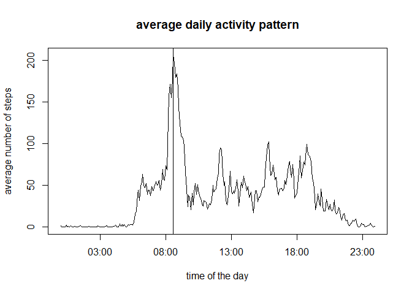

## Loading and preprocessing the data
Here is my code to load and transform the data.  

Notice that I use the `read_csv` from `readr` package instead of the standard `read.csv`, which allow to:  

* directly read from the zipped file inside the sip
* assign right classes to columns (as seen from the output below)


```r
library(readr)

activityDS<-read_csv("activity.zip")
```

```
## Parsed with column specification:
## cols(
##   steps = col_double(),
##   date = col_date(format = ""),
##   interval = col_double()
## )
```


## What is mean total number of steps taken per day?

(Use `dplyr` package to calculate the total number of steps taken per day).  


```r
library(dplyr)
```

#### Make a histogram of the total number of steps taken each day: 


```r
actiStats<-group_by(activityDS, date) %>%
    summarise(steps=sum(steps, na.rm = TRUE))

hist(actiStats$steps, 
     main = "number of steps taken each day (histogram)",
     xlab = "number of steps",
     ylab = "number of days")
```

<!-- -->


#### Mean and median of the number of steps taken per day

```r
c("mean"=mean(actiStats$steps), "median"=median(actiStats$steps))
```

```
##     mean   median 
##  9354.23 10395.00
```


## What is the average daily activity pattern?
We know that the intervals are 5 minutes apart, but what is the format of that variable?

```r
summary(activityDS$interval)
```

```
##    Min. 1st Qu.  Median    Mean 3rd Qu.    Max. 
##     0.0   588.8  1177.5  1177.5  1766.2  2355.0
```

```r
head(activityDS$interval, 40)
```

```
##  [1]   0   5  10  15  20  25  30  35  40  45  50  55 100 105 110 115 120 125 130
## [20] 135 140 145 150 155 200 205 210 215 220 225 230 235 240 245 250 255 300 305
## [39] 310 315
```

```r
tail(activityDS$interval, 40)
```

```
##  [1] 2040 2045 2050 2055 2100 2105 2110 2115 2120 2125 2130 2135 2140 2145 2150
## [16] 2155 2200 2205 2210 2215 2220 2225 2230 2235 2240 2245 2250 2255 2300 2305
## [31] 2310 2315 2320 2325 2330 2335 2340 2345 2350 2355
```
The `interval` variable is an integer going from 0 to 2355.  
It looks like the (1 or) 2 left most digit(s) in it are the hour of the day and the 2 rightmost are the minutes (see how the next values after each xx55 is yy00 and not xx60?).  
Which would mean that in fact, it is a time, going from 00:00 to 23:55

Lets check it:

```r
hist(activityDS$interval, breaks = seq(0, 2400, by=5)-1, xaxt = "n", cex = 0.2,
     xlab = "interval/100", 
     ylab = "number of days",
     main = "distribution of the intervals (histogram)")

axis(1, at = seq(0, 2400, by=100), labels = seq(0, 2400, by=100)/100)
```

_interval_histo-1.png)<!-- -->
  
OK, so what we saw with `head` and `tail` is consistent across the whole data set.  
  
Now we know how to make nice time series:  

* We convert interval into time (using the formatC function followed by a regexp)
* We don't add to it the date variable, since we want an average daily activity pattern across all days. So the date has to be the same for every observation. We just taking today's date (it won't be displayed anyway).
* (We are still removing NAs here)

```r
actiPatt<-group_by(activityDS, time = as.POSIXct(sub("(\\d{2})(\\d{2})", "\\1:\\2", 
                                                formatC(activityDS$interval, 
                                                        width = 4, flag = "0")), 
                                            format="%H:%M")) %>%
    summarise(steps=mean(steps, na.rm = TRUE))

plot(x=actiPatt$time, y=actiPatt$steps, type="l",
     xlab = "time of the day", 
     ylab = "average number of steps",
     main = "average daily activity pattern")
abline(v=actiPatt[actiPatt$steps==max(actiPatt$steps), ]$time)
```

<!-- -->
  
If we had directly plotted intervals on a numeric x-axis, we would have seen plateaus for all the non existent intervals, for example interval values between 1155 and 1200 (8 non-existent intervals each hour).  
Plotting intervals on a time x-axis allow us to get rid of these plateaus and see the real time series.  
  
#### Which 5-minute interval contains the maximum number of steps?
On average across all the days in the data set, this interval looks to be a bit after 8:00 AM (See vertical line above).  
let's pick-up the exact interval:

```r
c("maximum average activity at" = as.character(actiPatt[actiPatt$steps==max(actiPatt$steps), ]$time, "%H:%M"))
```

```
## maximum average activity at 
##                     "08:35"
```
  
  
## Imputing missing values
  
#### Total number of missing values in the data set

First, lets look for the NAs:  

```r
summary(activityDS)
```

```
##      steps             date               interval     
##  Min.   :  0.00   Min.   :2012-10-01   Min.   :   0.0  
##  1st Qu.:  0.00   1st Qu.:2012-10-16   1st Qu.: 588.8  
##  Median :  0.00   Median :2012-10-31   Median :1177.5  
##  Mean   : 37.38   Mean   :2012-10-31   Mean   :1177.5  
##  3rd Qu.: 12.00   3rd Qu.:2012-11-15   3rd Qu.:1766.2  
##  Max.   :806.00   Max.   :2012-11-30   Max.   :2355.0  
##  NA's   :2304
```
So we have NAs only in the "steps" variable and their total number is 2304.  

```r
c("proportion of NA"=sum(is.na(activityDS$steps))/dim(activityDS)[1])
```

```
## proportion of NA 
##        0.1311475
```
So 13% of the observations are NAs.  
  
  
Let's also check for any missing interval observations:  

```r
actiCount<-group_by(activityDS, date) %>%
    summarise(intercount= n())

summary(actiCount$intercount)
```

```
##    Min. 1st Qu.  Median    Mean 3rd Qu.    Max. 
##     288     288     288     288     288     288
```
So no missing observation (24 hours x 12 intervals/hour = 288 intervals each day).  
  
   
#### Strategy for filling in all of the missing values
Lets first have a look at the distribution of NAs:  

```r
actiNas<-group_by(activityDS, date) %>%
    summarise(Nas=sum(is.na(steps)))
hist(actiNas$Nas, breaks = nrow(actiNas), col="blue",
     xlab = "number of NAs",
     ylab = "number of days",
     main = "Number of NAs per day (histogram)")
```

_NA_distrib-1.png)<!-- -->
  
Hey ! we have only 2 values:  

```r
unique(actiNas$Nas)
```

```
## [1] 288   0
```
  
So this mean that we have only missing values for full days (288 intervals), but no missing values inside the other days.  
  
How many missing day?  

```r
nrow(actiNas[actiNas$Nas==288,])
```

```
## [1] 8
```

```r
nrow(actiNas[actiNas$Nas==288,]) / nrow(actiNas)
```

```
## [1] 0.1311475
```
Our 13% again, of course!  
   
      
So what strategy?  
  
We could replace those missing days by the average daily activity pattern calculated above, but this would be inventing data.  
Let's just replace the missing values with 0 (which happens to be the same as replacing them with the mean/median for that day, since they are 0 as well...).  

#### new data set with the missing data filled in

```r
actiFilled<-activityDS
actiFilled[is.na(actiFilled$steps),]$steps<-0
```

#### new histogram with the missing data filled in

```r
actiNewStats<-group_by(actiFilled, date) %>%
    summarise(steps=sum(steps))

hist(actiNewStats$steps,
     main = "number of steps taken each day (histogram)",
     sub = "NAs replaced by daily average",
     xlab = "number of steps")
```

<!-- -->

#### new mean and median with the missing data filled in  

```r
c("new mean"=mean(actiNewStats$steps), "new median"=median(actiNewStats$steps))
```

```
##   new mean new median 
##    9354.23   10395.00
```
  
Let' recall the old values with the NA removed:  

```r
c("mean"=mean(actiStats$steps), "median"=median(actiStats$steps))
```

```
##     mean   median 
##  9354.23 10395.00
```
  
As expected, they are exactly the same: when we removed the NAs, the daily average were already 0 for the days full of NAS!  
This way, there is no impact on the estimates of the total daily number of steps.  
   
## Are there differences in activity patterns between weekdays and weekends?
#### New variable indicating whether a given date is a weekday or weekend day

```r
actiFilled$day<-factor(ifelse(format(actiFilled$date, format = "%u") %in% c(6,7), 
                              "weekend",
                              "weekday"))
summary(actiFilled$day)
```

```
## weekday weekend 
##   12960    4608
```
  
(it's easier and more international to use directly the day of the week as a numeral, starting with Monday = 1)  
   
   
#### Make a panel plot containing a time series plot   
As before, we convert the interval values to time values before making the plot:  

```r
actiPanel<-group_by(actiFilled, 
                    day, 
                    time = as.POSIXct(sub("(\\d{2})(\\d{2})", "\\1:\\2", 
                                          formatC(actiFilled$interval, 
                                                  width = 4, flag = "0")), 
                                      format="%H:%M")) %>%
  summarise(steps=mean(steps))
```

Panel plot, using ggplot2:

```r
library(ggplot2)

g<-ggplot(actiPanel, aes(x=time, y=steps)) +
  labs(title ="average daily activity pattern", 
       x="time of the day",
       y = "average number of steps") + 
  geom_line() +
  facet_grid(day ~ .) +
  scale_x_datetime(date_labels = "%H:%M")
print(g)
```

<!-- -->
